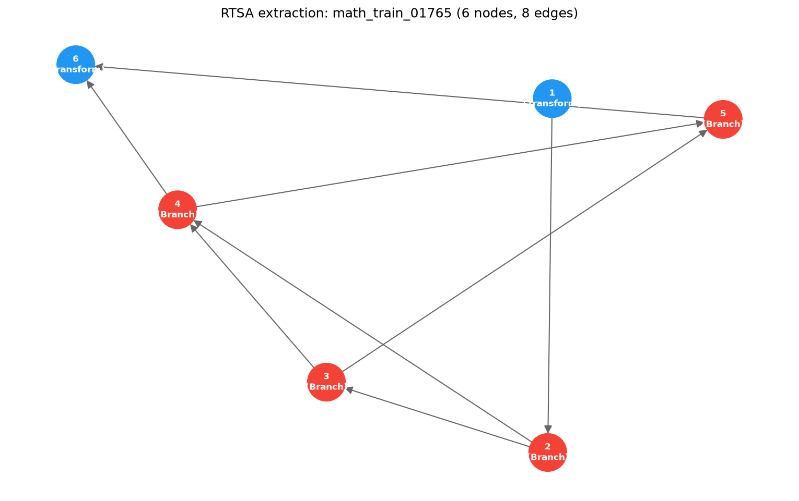

<h1 align="center">RTSA</h1>

<p align="center"><strong>Reasoning Trace Structure Analysis</strong> — study Chain-of-Thought reasoning as a structured graph; no white-box model access required.</p>

<p align="center">
  <a href="https://www.python.org/downloads/"></a>
  <a href="https://opensource.org/licenses/MIT"></a>
  <a href="https://github.com/Fengrru/rtsa/actions"></a>
  <a href="https://github.com/Fengrru/rtsa/actions"></a>
</p>

<p align="center"><a href="docs/README.md">Documentation</a> · <a href="docs/api.md">API Reference</a> · <a href="docs/comparison.md">Comparison</a> · <a href="CHANGELOG.md">Changelog</a></p>

---

## Motivation

Long reasoning traces are expensive to generate, opaque to inspect, and hard to verify — yet most tooling treats them as flat strings. RTSA parses CoT text into a typed DAG (Retrieve / Transform / Verify / Branch / Backtrack / Compare) and makes structural analysis practical: where the redundancy is, which step is likely wrong, whether structure predicts correctness, and who wrote the trace. Everything is computed from the text alone, so it works with any API-only model, requires no annotations, and every analysis is reproducible through a versioned experiment entrypoint.

## Example Extraction



Real extraction (rule-based) of a MATH problem's human solution: 6 nodes, 8 edges. Each node type carries a distinct color; the graph is the input to every downstream analysis.

## Quickstart

```bash
pip install rtsa
```

```python
from rtsa.extractors import RuleBasedExtractor
from rtsa.core.ngs_validator import NGSValidator
from rtsa.analysis.prune import RedundancyAnalyzer, PruneConfig

text = "Retrieve x=3. Transform: x*2=6. Verify: 6 is even."
graph = RuleBasedExtractor().extract(text, trace_id="demo_001")

valid, violations = NGSValidator().validate(graph)
report = RedundancyAnalyzer(config=PruneConfig()).analyze(graph, apply_pruning=True)
print(report.summary())
```

```bash
rtsa extract cot.txt --extractor rbe --output graph.json
rtsa validate graph.json
rtsa prune graph.json --apply --output pruned.json
```

## What RTSA Answers

| Question | Answer |
|---|---|
| Is this trace redundant, and where? | Region-level redundancy detection + executable DAG pruning (`rtsa/analysis/prune.py`) |
| Is this reasoning step correct? | Black-box step classifier on 17 structural features (`rtsa/analysis/step_classifier.py`, CRV-inspired) |
| Does structure predict correctness? | 19-metric benchmark with FDR correction and bootstrap CIs (`rtsa/analysis/performance_correlation.py`) |
| Which model wrote this? | Structural-style authorship fingerprinting (`rtsa fingerprint`) |
| How similar are two traces? | Supervised Robust-TSI + unsupervised WL-kernel similarity |

## Capabilities

| Capability | Implementation | Maturity |
|---|---|---|
| CoT -> graph extraction | `rtsa/extractors/` (rule / syntax / LLM / random baselines) | Stable |
| Structural validation | `rtsa/core/ngs_validator.py` — 13 NGS rules, Type I/II failure modes (7 classes) | Stable |
| Redundancy pruning | `rtsa/analysis/prune.py` — 4 detectors, DAG-preserving, domain-adaptive thresholds | Stable |
| Step-level analysis | `rtsa/analysis/step_classifier.py` `step_clustering.py` — 17-dim error probability, macro-step clustering | Evolving |
| Similarity & fingerprinting | `rtsa/core/robust_tsi.py` `rtsa/analysis/fingerprint.py` — supervised TSI, WL-kernel, authorship | Stable |
| Performance-correlation benchmark | `rtsa/analysis/performance_correlation.py` — 19 metrics, Spearman + BH-FDR + bootstrap CI | Evolving |
| Statistical rigor | `rtsa/core/robust_tsi.py` — bootstrap CI, Cohen's d, savings error bands | Stable |
| Extractor benchmarking | `rtsa/analysis/benchmark.py` — GCP + NGS pass rate + TSI | Stable |
| Dataset adapters | `rtsa/utils/hf_adapter.py` — any HuggingFace CoT dataset | Evolving |
| Observability | `rtsa/utils/trace_exporters.py` — OTLP / Langfuse, no-op fallback | Experimental |
| Reproducible experiments | `rtsa/experiments/run.py` — versioned runs + manifest.json | Stable |

Maturity levels: **Stable** (battle-tested, covered by tests) · **Evolving** (functional, API may shift) · **Experimental** (proof of concept, optional deps).

## Pipeline

```
raw CoT text (JSONL / HuggingFace datasets)
    |  extractors: RBE (rule) · SBE (syntax) · LLM · random baselines
    v
ReasoningTraceGraph (typed DAG)
    |
    +--> validate    NGS structural rules + failure-mode taxonomy
    +--> analyze     graph metrics, motifs, TSI/JSD, structure<->correctness
    +--> prune       redundancy regions -> pruned graph (DAG-preserving)
    +--> classify    per-step error probability (GradientBoosting)
    +--> benchmark   GCP · NGS pass rate · TSI · authorship fingerprint
```

## Related Work

| Work | Focus | RTSA counterpart |
|---|---|---|
| [LLM-MindMap](https://arxiv.org/abs/2505.13890) (EMNLP 2025) | Semantic step clustering; structural metrics predict performance | `rtsa/analysis/step_clustering.py` + `rtsa/analysis/performance_correlation.py` |
| [CRV](https://arxiv.org/abs/2510.09312) (Meta FAIR) | Verify reasoning steps from structural features (AUROC 70-92%); signatures are domain-dependent | `rtsa/analysis/step_classifier.py` + `PruneConfig.domain_overrides` |
| [CoT2Graph](https://openreview.net/forum?id=0XfuJjhaI5) | CoT-to-graph with reasoning-path validation and failure modes | `rtsa/core/ngs_validator.py` failure-mode taxonomy |

A capability-by-capability matrix is maintained in [docs/comparison.md](docs/comparison.md).

## Reproducible Experiments

```bash
python -m experiments.run extract     --dataset gsm8k --max-traces 50
python -m experiments.run correlation --synthetic
```

Every run lands in `rtsa/experiments/results/runs/<command>_<timestamp>/` with a `manifest.json` recording git commit, Python version, arguments, and UTC timestamp. See the [full CLI](docs/api.md#layer-5-experiments-experiments) for all subcommands.

## Results

Selected numbers from the built-in validation and real-data runs (reproducible via the commands above):

| Result | Value |
|---|---|
| Structural pruning, synthetic corpus | ~12.5% node compression, ~31 tokens/trace saved, 100% NGS pass rate |
| Structural pruning, GSM8K | self-limits to ~2% compression on naturally compact traces |
| Performance-correlation benchmark (synthetic validation, n=60) | 19 metrics, 12 significant after BH-FDR |
| Strongest effect (synthetic) | verify_density rho = -0.858, 95% CI [-0.881, -0.807] |
| Test suite | 322 tests passing (CI matrix: Python 3.10/3.11/3.12) |

## Documentation

- [docs/api.md](docs/api.md) — public API reference and module layout
- [docs/comparison.md](docs/comparison.md) — capability matrix vs. LLM-MindMap / CRV / CoT2Graph
- [docs/failure_modes.md](docs/failure_modes.md) — NGS failure-mode taxonomy
- [rtsa/experiments/notebooks/end_to_end.ipynb](rtsa/experiments/notebooks/end_to_end.ipynb) — end-to-end walkthrough
- [CHANGELOG.md](CHANGELOG.md) — version history (Keep a Changelog)

## Tests

```bash
python -m pytest tests/ -q
```

## Citation

```bibtex
@software{rtsa2026,
  title={RTSA: Reasoning Trace Structure Analysis Toolkit},
  author={Fengrru},
  year={2026},
  url={https://github.com/Fengrru/rtsa}
}
```

## Contributing & License

- Contributing: [CONTRIBUTING.md](CONTRIBUTING.md)
- License: [MIT](LICENSE)
